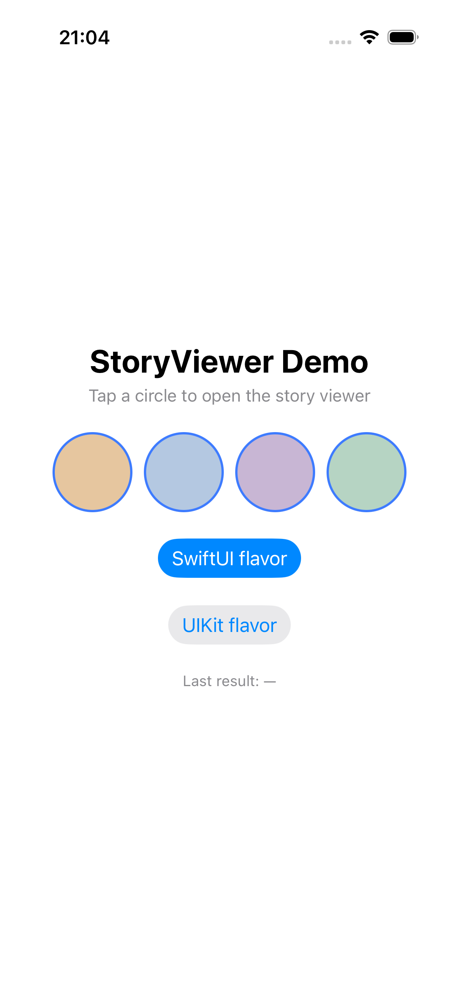
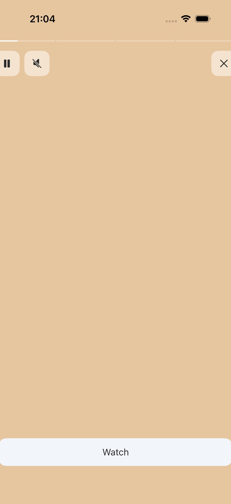
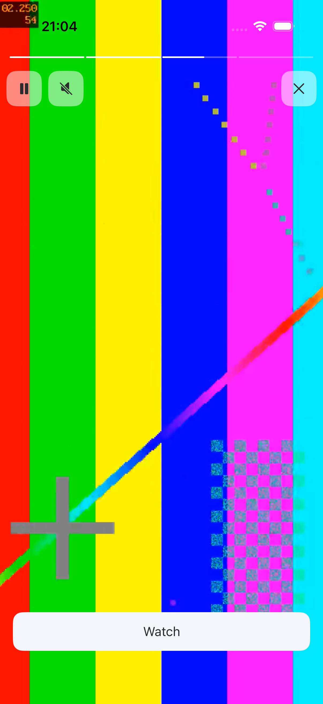

# storyviewer-ios

A full-screen story viewer for iOS (Instagram/Stories-style): progress bars on top, timer-based
auto-advance, tap left/right to navigate, pause/mute, image and video support (with an on-disk
video cache for instant opening). Available as a **UIKit** flavor and a **SwiftUI** flavor,
sharing the same underlying model and video cache. A 1:1 iOS counterpart of
[`storyviewer-android`](https://github.com/btctcn/storyviewer-android).

The library has no dependency on any specific backend or DI framework: "story viewed" and "link
clicked" events are reported back through plain closures, not through direct API calls.

## Screenshots

| Feed | Viewer | Video |
|---|---|---|
|  |  |  |

See the [`Demo`](Demo) app for a runnable, self-contained example (bundled placeholder
images/video, no network access required).

## Modules

| Product | What it is |
|---|---|
| `StoryViewerCore` | Shared, UI-toolkit-agnostic code: `StoryItem`, `StoryVideoCache`, `StoryImageLoader`, the shared `StoryVideoPlayerView`, and `StoryViewerModel` (the state machine both flavors drive). Not meant to be depended on directly. |
| `StoryViewerUIKit` | `StoryViewerViewController` — present modally, same closure-based finish contract as the SwiftUI flavor. |
| `StoryViewerSwiftUI` | `StoryViewerView` — a SwiftUI view you drop into your own navigation/presentation. |

## Installation (Swift Package Manager)

In Xcode: **File → Add Package Dependencies…** and enter:

```
https://github.com/btctcn/storyviewer-ios
```

Pick a version rule (e.g. "Up to Next Major Version" from `1.0.0`), then add the products you
need — `StoryViewerUIKit`, `StoryViewerSwiftUI`, or both — to your app target.

Or in `Package.swift`:

```swift
dependencies: [
    .package(url: "https://github.com/btctcn/storyviewer-ios", from: "1.0.0"),
],
targets: [
    .target(
        name: "YourApp",
        dependencies: [
            .product(name: "StoryViewerUIKit", package: "storyviewer-ios"),
            .product(name: "StoryViewerSwiftUI", package: "storyviewer-ios"),
        ]
    )
]
```

## Usage — UIKit flavor

```swift
import StoryViewerUIKit
import StoryViewerCore

let items = [
    StoryItem(id: "1", imageURL: URL(string: "https://...")!, linkURL: URL(string: "https://...")),
    StoryItem(id: "2", videoURL: URL(string: "https://...")!),
]

StoryViewerViewController.present(
    from: self,
    stories: items,
    startIndex: 0,
    onViewed: { id in /* mark `id` as viewed in your own model, optional */ },
    onFinished: { viewedIds, clickedLink in
        // mark viewedIds as viewed in your own model, handle clickedLink yourself
    }
)
```

Optionally, prefetch the first N stories' videos in the background (e.g. right after loading the
feed) so opening the viewer doesn't wait on network buffering:

```swift
StoryVideoCache.shared.prefetch(urls: videoURLs, onDownloadError: { error in /* your own analytics, optional */ })
```

### Theming (UIKit)

```swift
StoryViewerViewController.present(
    from: self,
    stories: items,
    style: StoryViewerStyle(watchButtonTextColor: .brandAccent),
    onFinished: { _, _ in }
)
```

## Usage — SwiftUI flavor

```swift
import StoryViewerSwiftUI

StoryViewerView(
    stories: items,
    startIndex: 0,
    style: .default,
    onViewed: { id in /* optional */ },
    onFinished: { viewedIds, clickedLink in
        // mark viewedIds as viewed in your own model, handle clickedLink yourself
    }
)
```

Present it however fits your navigation (`.fullScreenCover`, a `NavigationStack` destination,
etc.) — `StoryViewerView` itself is just a full-screen view, not a presentation mechanism.

## Demo app

The [`Demo`](Demo) folder is a small SwiftUI-hosted app (generated with
[XcodeGen](https://github.com/yonaskolb/XcodeGen) from `Demo/project.yml`) exercising both
flavors against sample images/video, plus an XCUITest target (`Demo/UITests`) used to smoke-test
both viewers on the simulator. Regenerate and run it with:

```sh
cd Demo
xcodegen generate
open StoryViewerDemo.xcodeproj
```

## License

MIT
